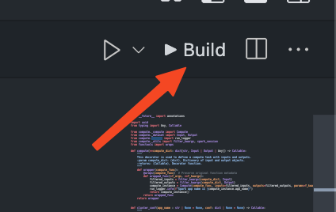

[](https://github.com/skanderboudawara/local_spark_cluster/actions/workflows/ci.yml)

# Local Spark Cluster Repository

## Table of Contents

- [Local Spark Cluster Repository](#local-spark-cluster-repository)
  - [Table of Contents](#table-of-contents)
  - [Purpose](#purpose)
  - [Repository Structure](#repository-structure)
  - [Getting Started](#getting-started)
    - [Prerequisites](#prerequisites)
    - [**Launching the Spark Cluster**](#launching-the-spark-cluster)
      - [1. **Navigate to the root directory of the repository**:](#1-navigate-to-the-root-directory-of-the-repository)
      - [2. **Start Docker containers:**](#2-start-docker-containers)
        - [1. Using deployment scripts:](#1-using-deployment-scripts)
        - [2. Using docker compose:](#2-using-docker-compose)
      - [3. **Check the status of your containers:**](#3-check-the-status-of-your-containers)
        - [1. Using deployment scripts:](#1-using-deployment-scripts-1)
        - [1. Using docker compose:](#1-using-docker-compose)
  - [**Creating PySpark jobs**](#creating-pyspark-jobs)
      - [1. **Importing the Spark Session:**](#1-importing-the-spark-session)
      - [3. **Input Data**](#3-input-data)
      - [2. **Writing your Spark logic**](#2-writing-your-spark-logic)
      - [3. **Writing output data**](#3-writing-output-data)
      - [5. **Script Template**](#5-script-template)
  - [**Executing Python jobs**](#executing-python-jobs)
    - [1. Using Deployment jobs](#1-using-deployment-jobs)
    - [2. Using Docker Compose](#2-using-docker-compose-1)
      - [1. **Access the Spark Master Container:**](#1-access-the-spark-master-container)
      - [2. **Run your python script:**](#2-run-your-python-script)
  - [**Spark Interfaces**](#spark-interfaces)
    - [**1. Accessing the Spark UI**](#1-accessing-the-spark-ui)
    - [**2. Accessing Spark History Server**](#2-accessing-spark-history-server)
  - [**Stopping the Spark Cluster**](#stopping-the-spark-cluster)
    - [1. Using Deployment Scripts](#1-using-deployment-scripts-2)
    - [2. Using Docker Compose](#2-using-docker-compose-2)
  - [Compute wrapper](#compute-wrapper)
    - [1. Goal of the wrapper](#1-goal-of-the-wrapper)
      - [1.1 `@compute`](#11-compute)
      - [1.2 `@cluster_config`](#12-cluster_config)
    - [2. How to use the compute wrapper](#2-how-to-use-the-compute-wrapper)
  - [**Testing and CI Pipeline**](#testing-and-ci-pipeline)
    - [**Testing Strategy**](#testing-strategy)
    - [**Continuous Integration (CI) Pipeline**](#continuous-integration-ci-pipeline)
  - [**Conclusion**](#conclusion)


## Purpose

This repository is designed to provide a Docker-based setup for running a Spark cluster, specifically tailored for executing PySpark scripts. Here’s a breakdown of its purpose:

Containerized Spark Environment: The repository uses Docker to create a self-contained Spark environment. This allows users to run Spark scripts locally without needing to install Spark and its dependencies directly on their machine.

Testing and Verification: The setup is intended for running small Spark scripts to test and verify their functionality. This is particularly useful for development and debugging purposes before deploying the scripts to a production environment.

## Repository Structure

```bash
local-spark-cluster/
 ├── .github/                     # GitHub workflows and actions
 │   └── workflows/
 │       └── ci.yml               # Continuous Integration workflow
 ├── data/                        # Data storage
 │   ├── input/                   # Input data
 │   └── output/                  # Output data
 ├── src/                         # Source code for Python scripts
 │   ├── compute/                 # Compute-related scripts and configurations
 │   ├── jobs/                    # Directory for user scripts
 │   │   ├── script_template.py   # Template for new scripts
 │   │   └── example_script.py    # Example Python script
 ├── vscode extension/            # Contains a vscode extension for spark submit
 ├── .gitignore                   # Git ignore file
 ├── docker-compose.yml           # Docker Compose configuration
 ├── README.md                    # Project documentation
 ├── spark_cluster.bat            # Batch script to manage Spark cluster
 └── spark_cluster.sh             # Bash script to manage Spark cluster
```

## Getting Started

### Prerequisites

- **[Docker](https://docs.docker.com/get-docker/)** and **[Docker Compose](https://docs.docker.com/compose/install/)** installed on your machine.
- Basic understanding of **[Apache Spark](https://spark.apache.org/)** and **[Python](https://www.python.org/)**.

### **Launching the Spark Cluster**

#### 1. **Navigate to the root directory of the repository**:

```bash
cd path/to/your_local_repository
```

---

*⚠️ Make sure to replace `path/to/your_local_repository` with your local repository path*

#### 2. **Start Docker containers:**

You can start the Docker containers using either the Docker Compose command or the provided deployment scripts:

##### 1. Using deployment scripts:

*Linux/Mac:*
```bash
./spark_cluster.sh deploy
```
*Windows:*
```batch
.\spark_cluster.bat deploy
```

##### 2. Using docker compose:

```bash
docker compose up -d
```

#### 3. **Check the status of your containers:**

##### 1. Using deployment scripts:

*Linux/Mac:*
```bash
./spark_cluster.sh status
```
*Windows:*
```batch
.\spark_cluster.bat status
```

##### 1. Using docker compose:

```bash
docker compose ps
```

---

✅If everything is working correctly, you should see the list of your running containers, showing the name, state (e.g., Up), and ports for each service.

*For example:*

```bash
Name                              Command               State           Ports                  
-----------------------------------------------------------------------------------------------
spark-cluster-spark-master_1      /opt/bitnami/scripts/  Up              0.0.0.0:8080->8080/tcp
spark-cluster-spark-worker-1      /opt/bitnami/scripts/  Up                                    
```

This means that both the Spark master and worker nodes are running as expected and are accessible on their respective ports.

---

❌ If there are any issues, the `State` column might show `Exited` or `Restarting`, indicating that one or more containers have failed to start or are repeatedly restarting.

*For example:*

```bash
Name                              Command               State           Ports                  
-----------------------------------------------------------------------------------------------
spark-cluster-spark-master_1      /opt/bitnami/scripts/  Exited         0.0.0.0:8080->8080/tcp
spark-cluster-spark-worker-1      /opt/bitnami/scripts/  Up                                    
```

## **Creating PySpark jobs**

You can create and run your own PySpark jobs by placing them in the [./src/jobs/](./src/jobs/) folder.

To do so, follow the process outlined below.


#### 1. **Importing the Spark Session:**

To initialize a Spark session, import the `session` function from the `compute` module:
- In the `session` function, you need to provide a unique name for your Spark application.
- This name will identify the application in the Spark UI and will also be used to define the input and output paths. 

```python
from compute import session

# Get the spark session and specify a name for your spark application
spark_session = session("YourSparkApplicationName")
```

#### 3. **Input Data**

Place your input files in [./data/input/YourSparkApplicationName](./data/input).

To use your inputs, utilize the `read` function, of the Spark DataFrame functionality:

Example:
```python
# Example usage of read_dataframe function
df: DataFrame = spark_session.read.csv(
    "data/input/PysparkWindow/fake_data",
    header=True,
    inferSchema=True,
)
```

---

#### 2. **Writing your Spark logic**

After initializing the Spark session, you can write your Spark logic as needed, such as reading data, performing transformations, analyzing datasets etc...

#### 3. **Writing output data**

To write your DataFrame output, use the `write` function, of the Spark DataFrame functionality:

 Exemple:
 ```python
    df.write.mode("overwrite") \
        .format("parquet") \
        .save("data/output/PysparkWindow/final")
 ```

#### 5. **Script Template**

If you're unsure how to structure your script, a template is available at [./src/jobs/script_classic.py](./src/jobs/script_classic.py)

This template includes the basic setup for initializing a Spark session, reading input data, processing data and writing an output dataset.

## **Executing Python jobs**

You can run your spark jobs using either the Docker Compose command or the provided deployment jobs:

### 1. Using Deployment jobs

*Linux/Mac:*
```bash
./spark_cluster.sh run <script_classic.py>
```
*Windows:*
```batch
.\spark_cluster.bat run <script_classic.py>
```

or you ca use this button directly after installing the vscode extensions



---

*⚠️ Make sure to replace `script_classic.py` with the name of your python file job

---

### 2. Using Docker Compose

#### 1. **Access the Spark Master Container:**

```bash
 docker exec -it spark-cluster-spark-master-1 /bin/bash
```

#### 2. **Run your python script:**

Use `spark-submit` to execute your script:

``` bash
spark-submit /src/jobs/script1.py
```

---

*⚠️ Make sure to replace `script1.py` with the name of your script.*

*Scripts are located in the `/src/jobs/` directory within the container*

---


## **Spark Interfaces**

### **1. Accessing the Spark UI**
You can access the Spark Master web UI to monitor your cluster and jobs by navigating to: [http://localhost:8080](http://localhost:8080).

This UI provides an overview of the Spark cluster, including the status of jobs, executors, and other resources.

---

*For more details, refer to the official documentation: [Spark Monitoring and Instrumentation](https://spark.apache.org/docs/latest/monitoring.html)*

### **2. Accessing Spark History Server**
To view the history of completed Spark applications, you can access the Spark History Server at: [http://localhost:18080](http://localhost:18080).

This interface allows you to review the details of past Spark jobs, including execution times and resource usage.

---
*For more details, refer to the official documentation: [Spark History Server](https://spark.apache.org/docs/latest/monitoring.html#viewing-after-the-fact)*


## **Stopping the Spark Cluster**

When you are finished using the Spark cluster, you can stop all running containers.

You can stop hte PSark Cluster using either the Docker Compose command or the provided deployment scripts:

### 1. Using Deployment Scripts

*Linux/Mac:*
```bash
./spark_cluster.sh stop
```
*Windows:*
```batch
.\spark_cluster.bat stop
```

### 2. Using Docker Compose

```bash
 docker compose down
```

These command will stop and remove the containers defined in the docker-compose.yaml.

## Compute wrapper

### 1. Goal of the wrapper
The `@comput` and `@cluster_config` decorators are likely used to manage and configure the computational environment for running Spark jobs. Here's a detailed explanation of why these might be created:

#### 1.1 `@compute`

The `@compute` decorator is typically used to define a function or method that performs a specific computation. In the context of a Spark environment, this decorator might be used to:

Encapsulate Computation Logic: It helps in encapsulating the logic of a Spark job, making the code more modular and easier to manage. Check `src/jobs/script_compute.py`

Resource Management: It can handle the setup and teardown of resources needed for the computation, such as initializing Spark contexts and ensuring they are properly closed after the job is done.

Error Handling: It can provide a standardized way to handle errors that occur during the computation, ensuring that resources are cleaned up properly even if an error occurs.

ere’s a hypothetical example to illustrate how these decorators might be used:
In this example:

```python
from compute import cluster_config, compute, Input, Output

@compute(
    input1=Input("path_to_input"),
    output1=Output("path_to_output"),
)
```

#### 1.2 `@cluster_config`
The `@cluster_config` is an optional decorator and is used to manage the configuration of the Spark cluster. This can include:

Cluster Settings: It allows you to specify settings for the Spark cluster, such as the number of nodes, memory allocation, and other cluster-specific parameters.

Environment Configuration: It can be used to set up environment variables and other configurations needed for the Spark jobs to run correctly.

Reusability: By using a decorator, you can easily apply the same configuration to multiple Spark jobs without duplicating code.
Example Usage

Here’s a hypothetical example to illustrate how these decorators might be used:
In this example:

```python
from compute import cluster_config, compute, Input, Output

spark_sql_config = {
    "spark.sql.shuffle.partitions": "200",       # Number of partitions to use when shuffling data for joins or aggregations.
    "spark.sql.execution.arrow.enabled": "true",            # Enables Arrow optimization for Pandas UDFs.
    "spark.sql.sources.partitionOverwriteMode": "dynamic",  # Allows dynamic partition overwrite.
    "spark.sql.adaptive.enabled": "true",                   # Enables adaptive query execution for better performance.
    "spark.sql.catalogImplementation": "hive",              # Uses Hive for catalog implementation.
    "spark.sql.parquet.filterPushdown": "true",             # Enables pushdown of filters for Parquet files.
    "spark.sql.caseSensitive": "false",                     # Makes Spark SQL case insensitive.
    "spark.sql.join.preferSortMergeJoin": "true",           # Prefers sort-merge join strategy.
    "spark.sql.files.maxPartitionBytes": "128MB",           # Max size of a single file partition for input files.
}
@cluster_config(spark_sql_config) # configures the Spark cluster.
@compute(
    input1=Input("path_to_input"),
    output1=Output("path_to_output"),
)
```

`@compute` handles the setup and teardown of the Spark session, as well as any error handling.
These decorators help in making the code more readable, maintainable, and reusable by abstracting away the boilerplate code associated with setting up and configuring Spark jobs.

### 2. How to use the compute wrapper

As show in the example found in `src/jobs/script_compute.py`, both decorator indicates clearly what is the spark configuration and what are my inputs and my outputs and where they will be stored.

In a glance, we can identify these information without digging into the code base.

Also with this wrapper we can have multiple inputs and multiple outputs.

## **Testing and CI Pipeline**

### **Testing Strategy**

The repository includes a comprehensive testing strategy to ensure the reliability and correctness of the Spark cluster setup and PySpark jobs. The testing strategy involves:

1. **Unit Tests**: 
    - Located in the `tests/` directory.
    - Ensure individual components and functions work as expected.
    - Use the `pytest` framework for writing and running tests.

### **Continuous Integration (CI) Pipeline**

The repository uses GitHub Actions for Continuous Integration (CI) to automate the testing process. The CI pipeline is defined in the `.github/workflows/ci.yml` file and includes the following steps:

The main tools used are:

1. ruff
2. mypy
3. pytest
4. tox

## **Conclusion**

This repository provides a Spark environment to run small PySpark jobs.

Feel free to add jobs in the [/src/jobs/](./src/jobs/) directory as needed for your data processing needs.

For any questions or issues, please refer to the following resources:
- [Apache Spark Documentation](https://spark.apache.org/docs/latest/)
- [Docker Documentation](https://docs.docker.com/)
- [Bitnami Spark Docker Documentation](https://github.com/bitnami/bitnami-docker-spark)
- [PySpark Documentation](https://spark.apache.org/docs/latest/api/python/)

---

For further assistance, feel free to contact us directly at
- [mathieu.masson@alten.com](mailto:mathieu.masson@alten.com)
- [skander.boudawara@gmail.com](mailto:skander.boudawara@gmail.com)

