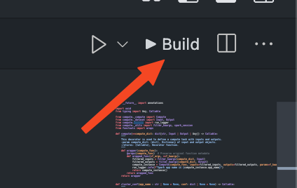
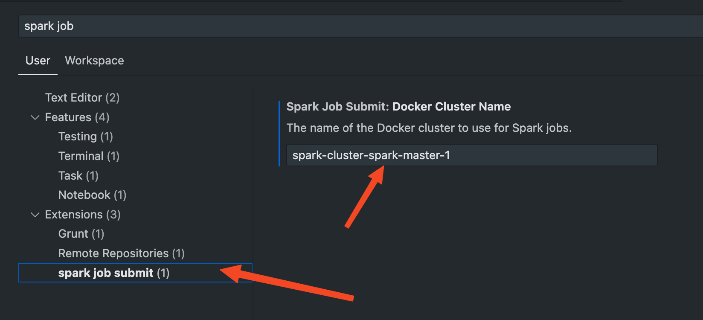

# Spark Job Submitter README

This extension allows you to submit Spark jobs easily using a Docker container with Spark configuration.

## Prerequisites

- Docker installed and running
- A Docker container with Spark configuration

## Installation

1. Install the extension in Visual Studio Code.
2. Ensure your Docker container with Spark is running.

## Usage

### Running the Spark Job

You can run the Spark job using the following methods:

- **Mac**: Press `CMD+SHIFT+P`
- **Windows**: Press `CTRL+SHIFT+P`

Then, type `Submit Spark Job`.

Alternatively, you can click the button next to the run/play button in the interface.



## What Does This Button Do?

The button executes the following command:

```sh
docker exec -it ${your_container_name} spark-submit ${path_of_your_file}
```

Replace `${your_container_name}` with the name of your Docker container and `${path_of_your_file}` with the path to your Spark job file.

You can always change the container name in vscode settings

